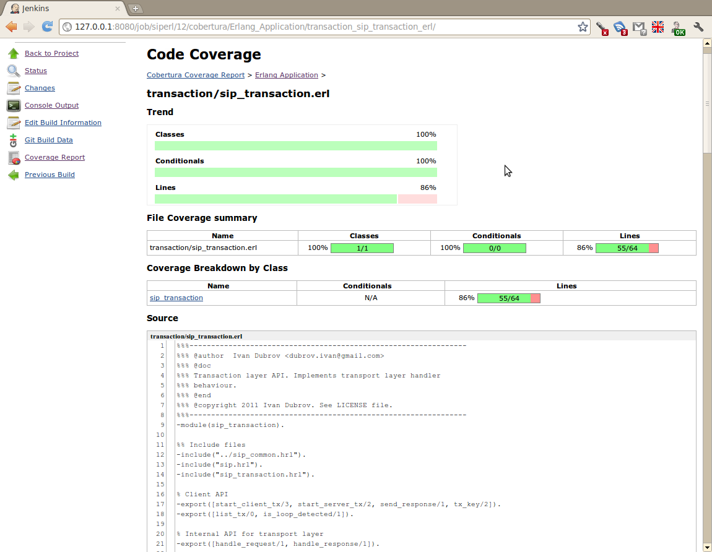
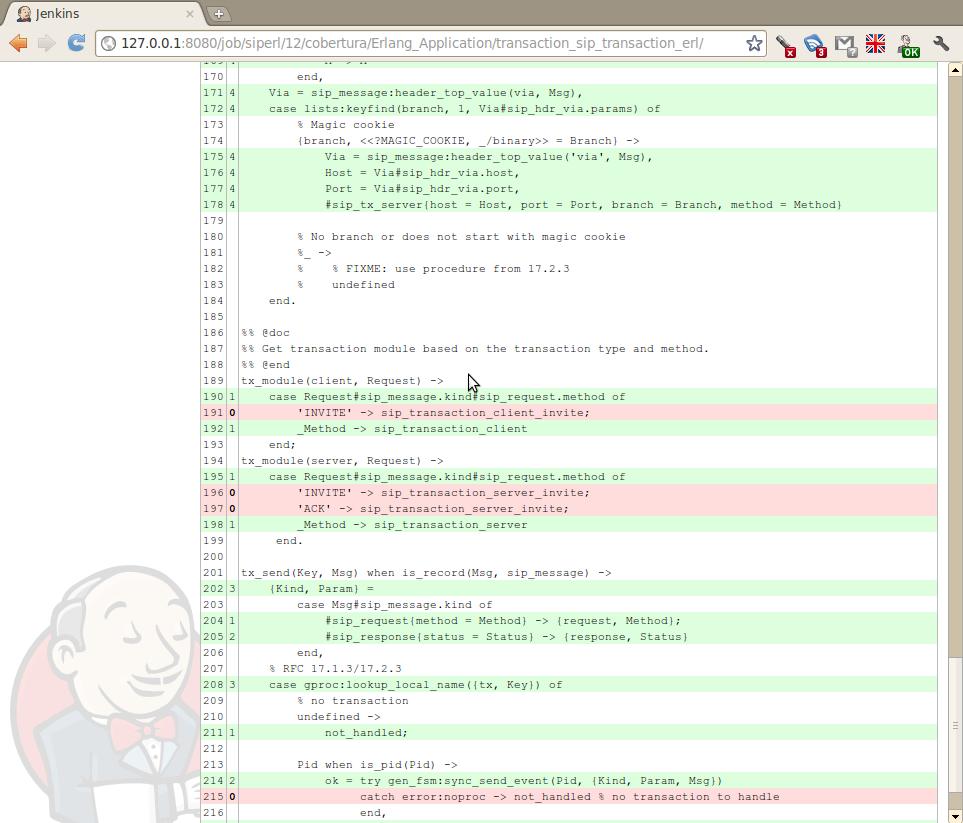

Cover-to-Cobertura Conversion Tool 
==================================

A simple tool to convert exported Erlang `cover` data sets into Cobertura XML
reports. The report could be then feed to the Jenkins Cobertura plug-in.

Usage:

    $ covertool -cover all.coverdata -output coverage.xml -src src/

Sample cover.spec for common_test:

    {incl_app, app0, details}.
    {export, "all.coverdata"}.

Screenshots
-----------

